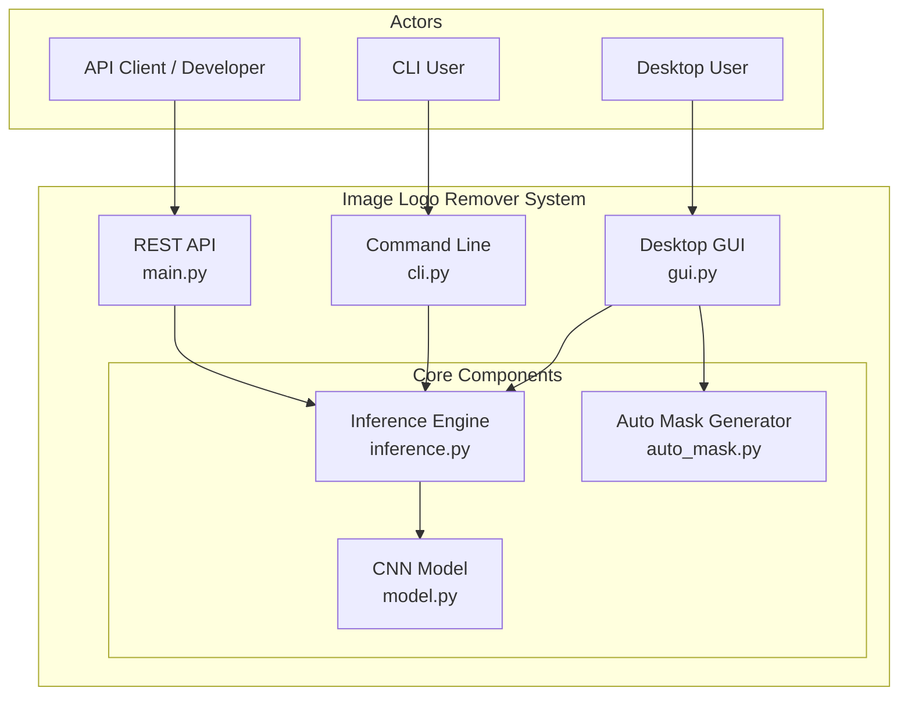
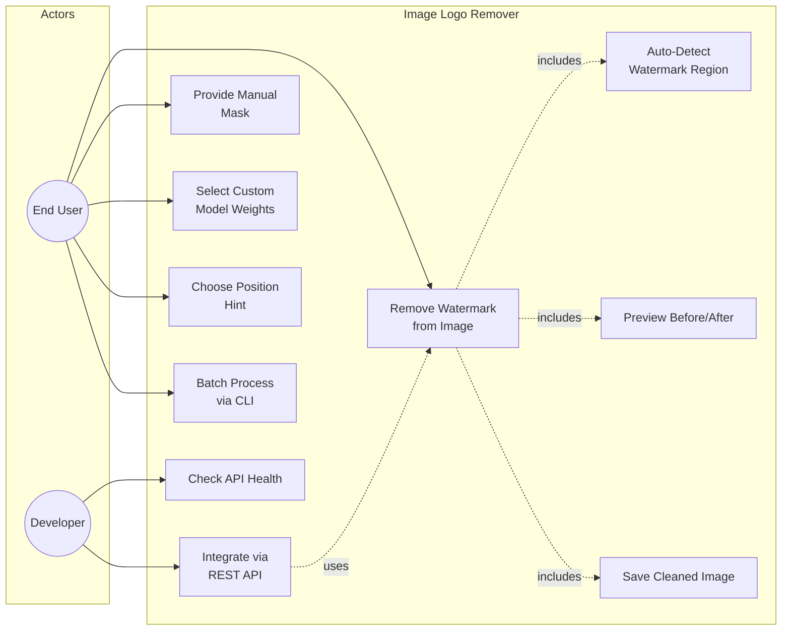
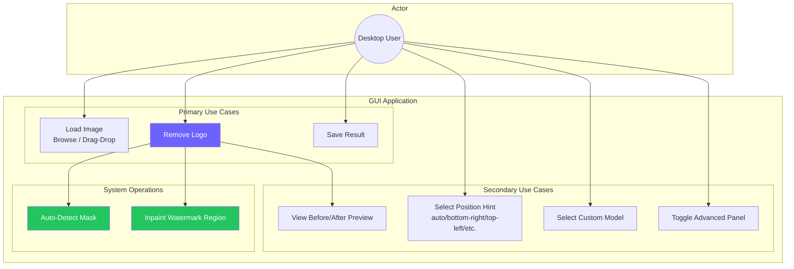
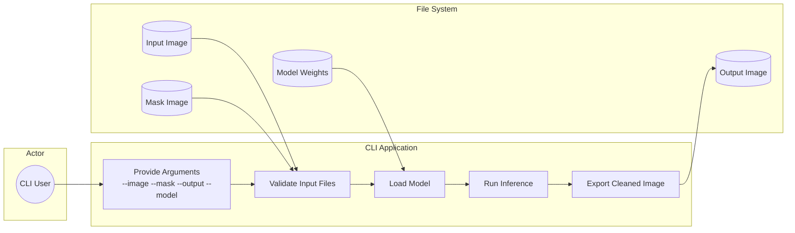
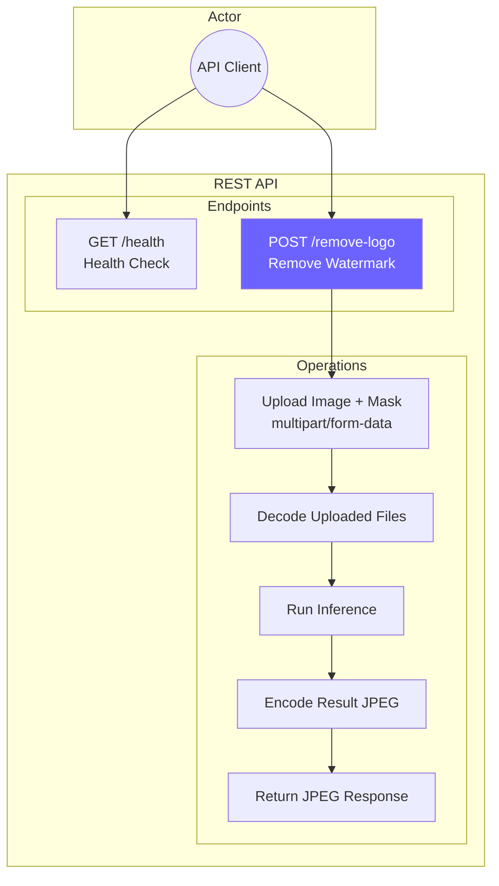
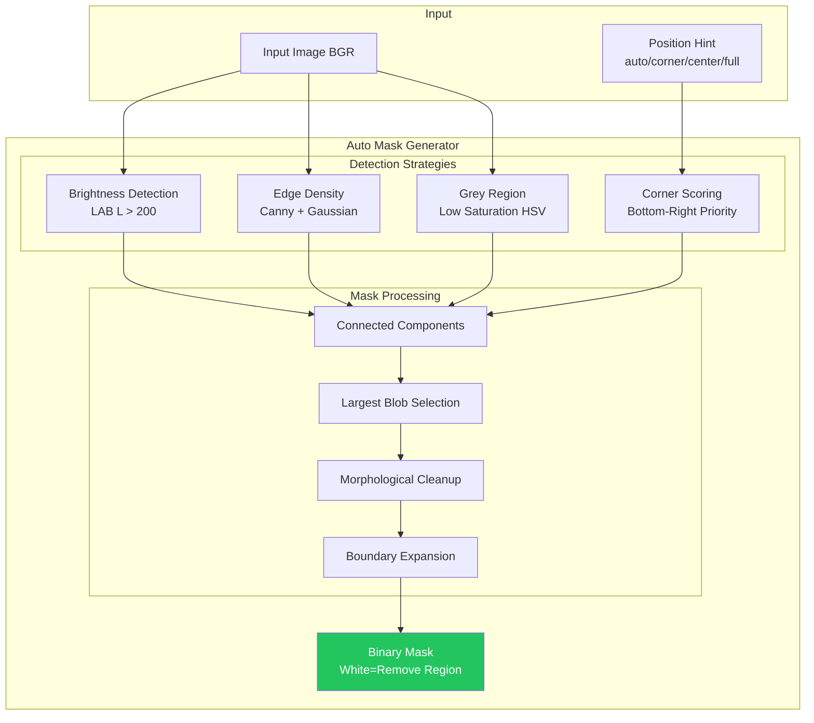
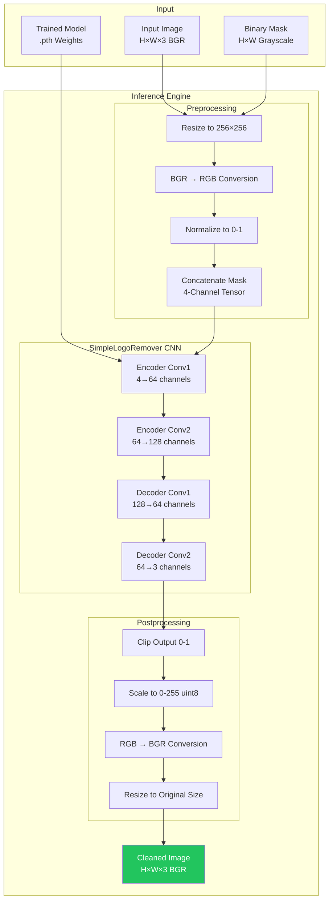
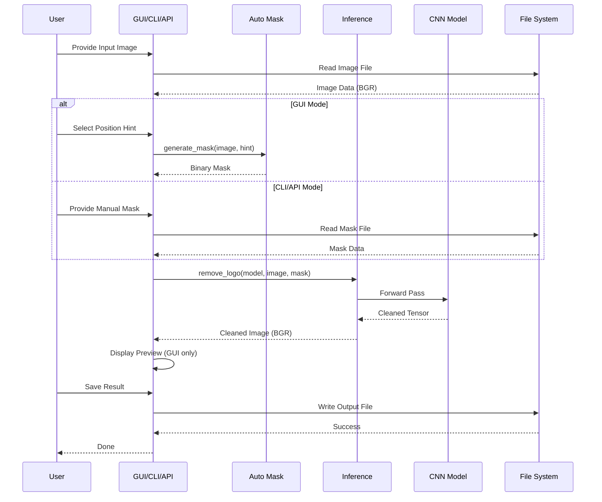

# Use Case Diagrams — Image Logo Remover

This document contains use case diagrams for the Image Logo Remover application using Mermaid syntax.

---

## 1. System Overview

---

## 2. Main Use Case Diagram

---

## 3. GUI User Use Cases

---

## 4. CLI User Use Cases

---

## 5. API Use Cases

---

## 6. Auto-Mask Generation Use Cases

---

## 7. Inference Pipeline Use Cases

---

## 8. Complete System Sequence

---

## Use Case Descriptions

### UC-01: Remove Watermark from Image
**Actor:** End User (GUI/CLI/API)  
**Description:** Remove a logo or watermark from an image using the trained model.  
**Preconditions:** Valid image file exists  
**Postconditions:** Cleaned image saved or returned  
**Main Flow:**
1. User provides input image
2. System generates or receives mask
3. System runs inference
4. System returns/saves cleaned image

### UC-02: Auto-Detect Watermark Region
**Actor:** System (GUI mode)  
**Description:** Automatically detect the watermark region without user input.  
**Preconditions:** Image loaded  
**Postconditions:** Binary mask generated  
**Main Flow:**
1. Detect low-saturation grey regions
2. Score corner zones
3. Select highest-scoring region
4. Clean up mask morphologically

### UC-03: Provide Manual Mask
**Actor:** CLI/API User  
**Description:** Provide a pre-made mask image for precise control.  
**Preconditions:** Mask file matches image dimensions  
**Postconditions:** Mask used for inference

### UC-04: Preview Before/After
**Actor:** GUI User  
**Description:** View original and cleaned images side-by-side.  
**Preconditions:** Image loaded and processed  
**Postconditions:** User can compare results

### UC-05: Save Cleaned Image
**Actor:** End User  
**Description:** Export the cleaned image to disk.  
**Preconditions:** Processing complete  
**Postconditions:** File written to specified path

### UC-06: Select Custom Model
**Actor:** Advanced User  
**Description:** Use a different trained model weights file.  
**Preconditions:** Valid .pth file exists  
**Postconditions:** Custom model used for inference

### UC-07: Choose Position Hint
**Actor:** GUI User  
**Description:** Guide auto-detection with position hint.  
**Options:** auto, bottom-right, bottom-left, top-right, top-left, center, full  
**Postconditions:** Detection focused on specified region

### UC-08: Check API Health
**Actor:** API Client  
**Description:** Verify API server is running and model is loaded.  
**Endpoint:** GET /health  
**Response:** `{status, device, model_loaded}`

### UC-09: Batch Process via CLI
**Actor:** CLI User  
**Description:** Process multiple images via shell scripting.  
**Preconditions:** Multiple images and masks available  
**Postconditions:** All images processed

### UC-10: Integrate via REST API
**Actor:** Developer  
**Description:** Integrate logo removal into another application.  
**Endpoint:** POST /remove-logo  
**Input:** multipart/form-data (image + mask)  
**Output:** JPEG image

---

## Actor Summary

| Actor | Interface | Use Cases |
|-------|-----------|-----------|
| Desktop User | `gui.py` | UC-01, UC-02, UC-04, UC-05, UC-06, UC-07 |
| CLI User | `cli.py` | UC-01, UC-03, UC-05, UC-06, UC-09 |
| API Client | `main.py` | UC-01, UC-03, UC-05, UC-08, UC-10 |

---

## Component Summary

| Component | File | Responsibility |
|-----------|------|----------------|
| GUI | `gui.py` | Desktop interface with drag-drop, preview |
| CLI | `cli.py` | Command-line argument parsing, file I/O |
| REST API | `main.py` | FastAPI endpoints, multipart handling |
| Inference | `inference.py` | Model loading, preprocessing, postprocessing |
| Auto Mask | `auto_mask.py` | Automatic watermark region detection |
| Model | `model.py` | SimpleLogoRemover CNN architecture |
